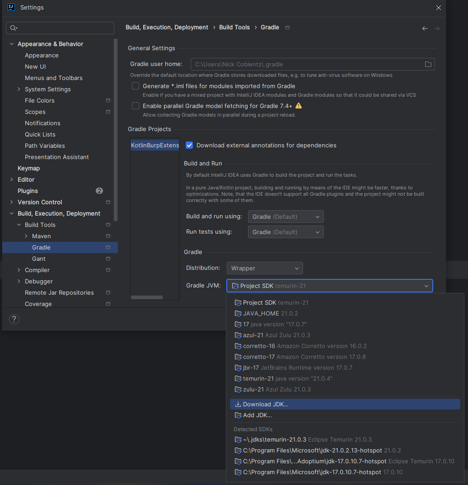
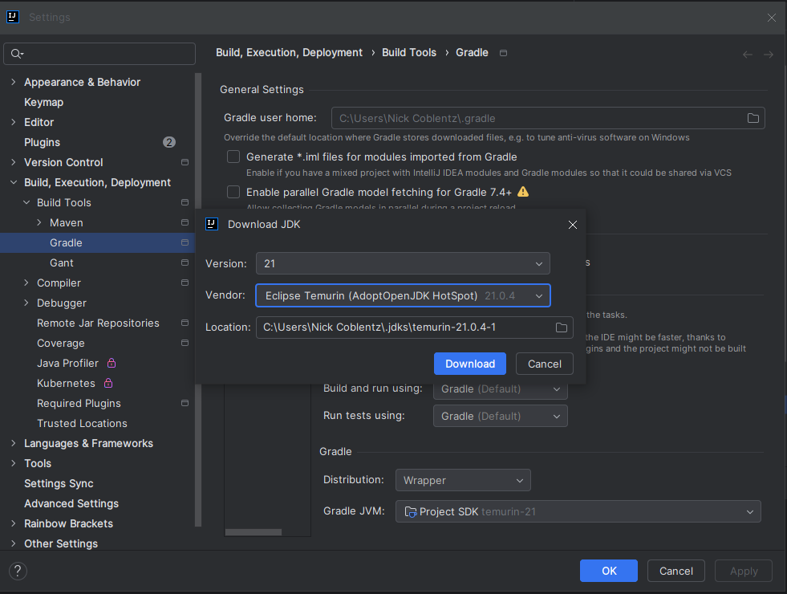
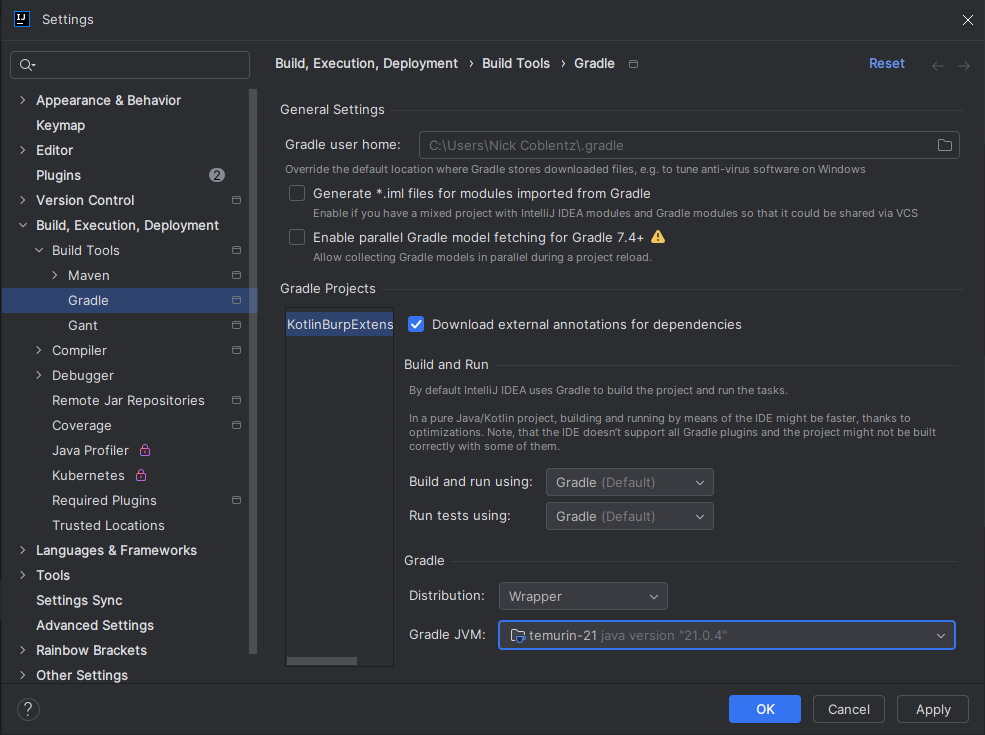
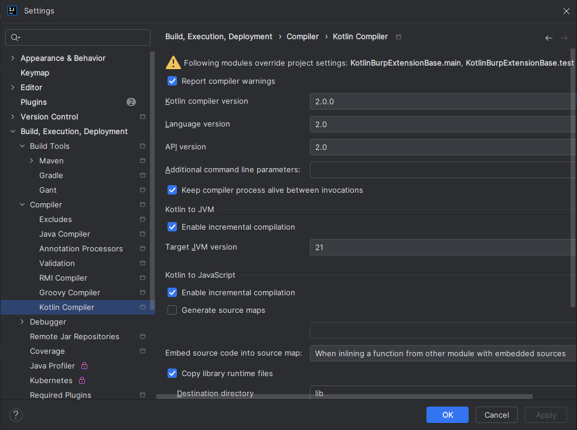
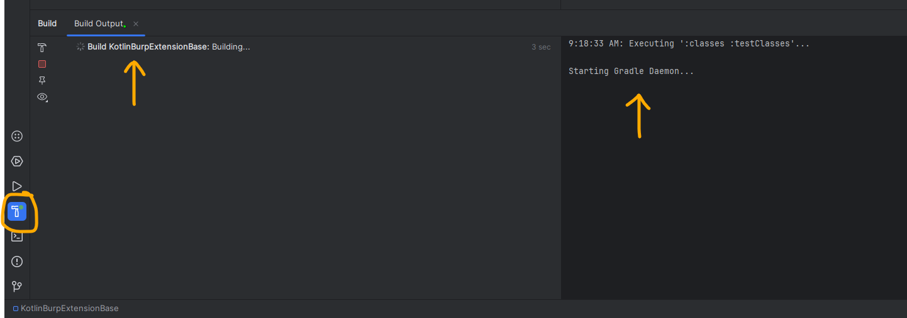
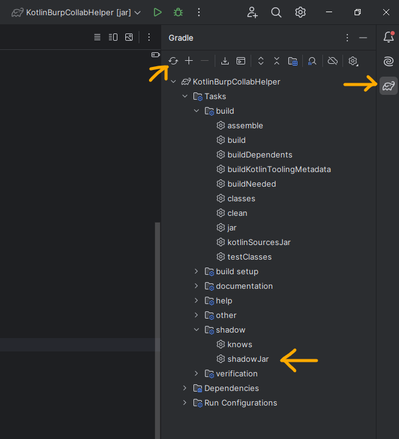

# Your Kotlin Burp Extension Name Here!

_By [Nick Coblentz](https://www.linkedin.com/in/ncoblentz/)_

__This Burp Extension Template is made possible by [Virtue Security](https://www.virtuesecurity.com), the Application Penetration Testing consulting company I work for.__

This project provides the starting point for building a Burp Extension in Kotlin using the Montoya API. Replace this paragraph with a description of your plugin.

## Setup Steps
### Install IntelliJ

Download the JetBrains Toolbox App and install IntelliJ Community (there's also a pro) through it: https://www.jetbrains.com/toolbox-app/

### Configure Intellij

Be sure to configure the following settings in Intellij by choosing `File -> Settings`

#### Setup Gradle: Download a Java 21+ JDK

### Configure Kotlin to use 2.x

### Project

#### Gradle Settings

1. In `build.gradle.kts`, change `group = "com.yourname.montoya"` to reflect your name or company
2. In `settings.gradle.kts` change `rootProject.name = "KotlinBurpExtensionBase"` to the name of your extension/project

#### Intellij Settings

1. Open `File -> Project Structure -> Project` and change the `Name` field to the name of your new project.

#### Initializing and Reloading Gradle

When first starting up a project, IntelliJ will set up Gradle, download dependencies, and try an initial build. You can see the status of this process in the "Build" tab, as shown in the screenshot. If you do not see that tab, go to View -> Tool Window -> Build.

Whenever you change the `build.gradle.kts` or `settings.gradle.kts` file, you may have to tell IntelliJ to reload Gradle dependencies, by using the buttons shown below. This screenshot also shows the location of the "shadowJar" build task.

### How to Build a Project

#### From Command Line

When you want to produce a Burp suite extension, you will need to build a jar that includes any external libraries and related Kotlin libraries. Build a plugin at the command line with:
- Linux: `gradlew shadowJar`
- Windows: `gradlew.bat shadowJar`

#### Within IntelliJ

Click the Elephant Symbol on the far right hand bar and visit `Tasks -> shadow -> shadowJar`

### Add the Extension to Burp Suite

A `projectname-x.y.z.all.jar` file will be produced in `build/libs/` where `x.y.z` is the version number from `build.gradle.kts`. Add this to Burp Suite by:
1. Open Burp Suite
2. Click the "Extensions" tab
3. Click "Add"
4. For "Extension Type", choose "Java"
5. Click the "Select File" button, and choose the `projectname-x.y.all.jar` from above

## Resources For Learning Kotlin and Building Burp Extensions

### Documentation

#### Kotlin
- Kotlin: An Illustrated Guide: https://typealias.com/start/
- Kotlin Documentation: https://kotlinlang.org/docs/basic-syntax.html
- Kotlin Cheat Sheet: https://github.com/alidehkhodaei/kotlin-cheat-sheet

#### Montoya API Based Extensions
- Montoya API Documentation: https://portswigger.github.io/burp-extensions-montoya-api/javadoc/
- Java (Not in Kotlin unfortunately) Burp Extension Examples: https://github.com/PortSwigger/burp-extensions-montoya-api-examples
- Kotlin Burp Extension Template: https://github.com/ncoblentz/KotlinBurpExtensionBase

## Debugging An Extension

### Logging Statements

One method to debug plugins is to use `api.logging().logToOutput("Debug location 1: ${myvariablehere}")`.

### Intellij Debugger

Another method is to use the Intellij Debugger. To set it up, we first need to tell Burp Suite to allow debugging with these steps:
1. Create a `user.vmoptions` file containing `-agentlib:jdwp=transport=dt_socket,address=localhost:8700,server=y,suspend=n`
2. Place that file in your Burp Suite install directory. 
   - For example: `/home/yourusername/BurpSuitePro/` (linux)
2. Open Burp Suite
3. In IntelliJ Open the Menu and choose `Run -> Attach to Process`. Choose the Burp Suite process listening on port 8700
4. Set a breakpoint in the "YourBurpKotlinExtensionName" class by clicking the line number next to the hello world statement
5. Load (or reload with ctrl + click) your extension and watch it stop at the breakpoint inside of IntelliJ

## Examples Using This Template That Can Be Used As Templates Themselves

The following projects used this repository as a template and demonstrate the following Burp or Java features:
- https://github.com/ncoblentz/BurpKotlinSignalRAndWebSocketDemo
  - HTTP Message Editor
  - Proxy Request Listener, Adds Notes To HTTP Proxy History Requests
- https://github.com/ncoblentz/KotlinBurpJwtTokenHandlerDemo
  - Session Handling Action
  - Right-Click Context Menu
  - Persistent Project Settings and UI to Manage Settings
- https://github.com/ncoblentz/MakeHttpRequestDemo
  - Java 21 Virtual Threads
  - Make new HTTP Requests
  - Right-Click Context Menu
  - Persistent Project Settings and UI to Manage Settings
- https://github.com/ncoblentz/KotlinBurpCollabHelper
  - Use collaborator payloads and monitor for interactions
  - Right-Click Context Menu
  - Persistent Project Settings and UI to Manage Settings
  - Create audit issue
- https://github.com/ncoblentz/BurpKotlinWSocketJSONArrayEditor
  - Adds a WebSocket Message Editor Tab

## Re-Usable Library for Creating Persistent Project Setttings and Generating a User Interface to Manage them

Plus a lot of other time-saving helper functions
- https://github.com/ncoblentz/BurpMontoyaLibrary
